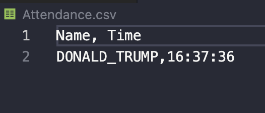

Face Recognition & Attendance Project
Create a folder AttendanceImages and place all your images.
Create a file Attendence.csv to make an entry.
Run the AttendanceProject.py

Ask person to face Webcam. The person will be validated and an entry will be recorded in Attendence.csv

Output is

and 

